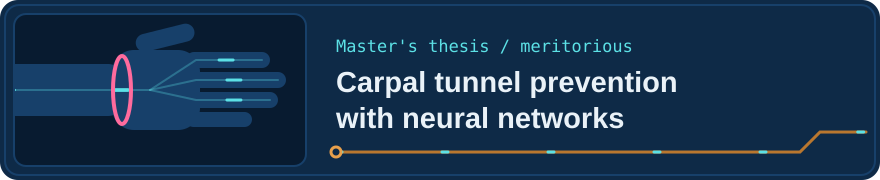
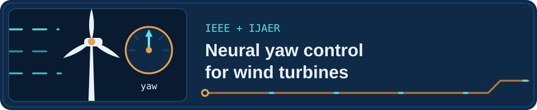
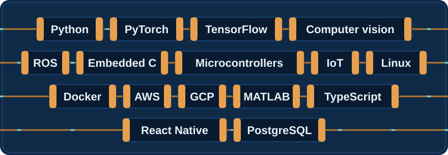

  

  I teach machines to see, and I build the electronics and robots that put that vision to work.

  

## Research in motion

Tap a card to open the paper.

  
  
  
  
  
  
  
  
  

## Toolbox

  

## Contributions

  
  

  

## Contact

  <a href="mailto:dialejobv@yahoo.com">Email</a> |
  <a href="https://www.linkedin.com/in/diego-alejandro-barrag%C3%A1n-vargas-2958b0171">LinkedIn</a> |
  <a href="https://scholar.google.com/citations?hl=es&user=Bp3QMQMAAAAJ">Google Scholar</a> |
  <a href="https://scienti.minciencias.gov.co/cvlac/visualizador/generarCurriculoCv.do?cod_rh=0001655355">CvLAC</a>

